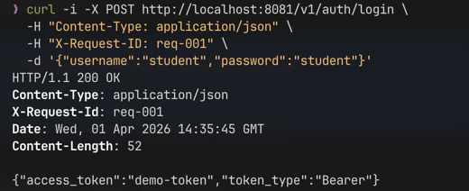
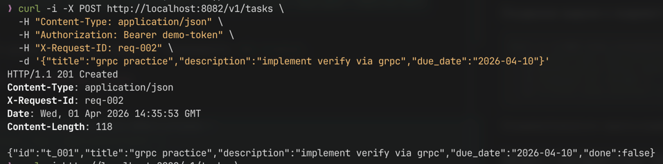
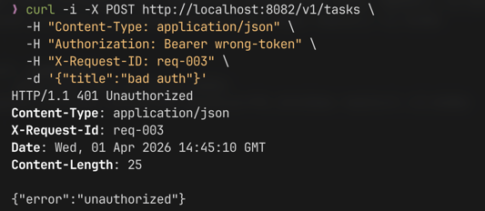
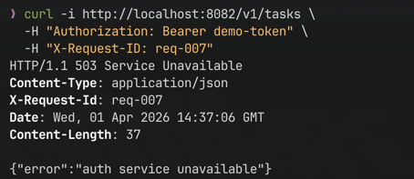
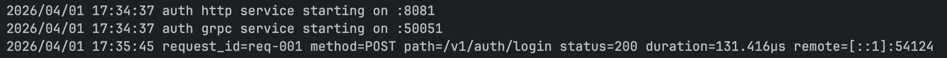
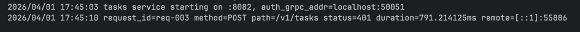
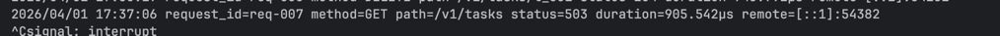

# Практическое занятие №2

# Рузин Иван Александрович ЭФМО-01-25

# gRPC: создание простого микросервиса, вызовы методов

---

## 1. Краткое описание

В данной работе реализовано взаимодействие двух сервисов через gRPC.

`Auth service` отвечает за проверку токена и поднимает gRPC-сервер с методом `Verify`.  
`Tasks service` сохраняет HTTP API для работы с задачами, однако проверка авторизации выполняется уже не по HTTP, а
через gRPC-вызов в `Auth service`.

Таким образом, клиент по-прежнему работает с `Tasks service` по HTTP, а внутреннее взаимодействие между сервисами
переведено на gRPC.

---

## 2. Схема взаимодействия

```mermaid
sequenceDiagram
    participant C as Client
    participant T as Tasks service
    participant A as Auth service (gRPC)

    C->>T: HTTP request with Authorization header
    T->>A: gRPC Verify(token)
    A-->>T: subject / error
    T-->>C: HTTP response
````

---

## 3. Контракт (`proto`)

В проект добавлен файл `proto/auth.proto`, который описывает gRPC-контракт между сервисами.

```proto
syntax = "proto3";

package auth;

option go_package = "tip2_pr2/proto;proto";

service AuthService {
  rpc Verify(VerifyRequest) returns (VerifyResponse);
}

message VerifyRequest {
  string token = 1;
}

message VerifyResponse {
  bool valid = 1;
  string subject = 2;
}
```

Файл `.proto` выступает контрактом: он задаёт сервис, доступные методы и структуру сообщений, которыми обмениваются
клиент и сервер.

---

## 4. Генерация кода

Для генерации Go-кода использовались стандартные плагины `protoc-gen-go` и `protoc-gen-go-grpc`.

Установка:

```bash
go install google.golang.org/protobuf/cmd/protoc-gen-go@latest
go install google.golang.org/grpc/cmd/protoc-gen-go-grpc@latest
```

Команда генерации:

```bash
protoc \
  --go_out=. \
  --go-grpc_out=. \
  proto/auth.proto
```

Сгенерированные файлы размещаются в каталоге `proto/`:

* `proto/auth.pb.go`
* `proto/auth_grpc.pb.go`

---

## 5. Обработка ошибок и соответствие HTTP-статусам

При реализации использован следующий маппинг ошибок gRPC на HTTP-ответы в `Tasks service`.

| gRPC код           | HTTP статус               | Назначение                                 |
|--------------------|---------------------------|--------------------------------------------|
| `Unauthenticated`  | `401 Unauthorized`        | передан невалидный токен                   |
| `DeadlineExceeded` | `503 Service Unavailable` | auth-сервис не ответил за отведённое время |
| `Unavailable`      | `503 Service Unavailable` | auth-сервис недоступен                     |
| прочие ошибки      | `502 Bad Gateway`         | ошибка межсервисного взаимодействия        |

---

## 6. Структура проекта

```text
tip2_pr2/
  go.mod
  proto/
    auth.proto
    auth.pb.go
    auth_grpc.pb.go
  shared/
    middleware/
      logging.go
      requestid.go
  services/
    auth/
      cmd/
        auth/
          main.go
      internal/
        grpc/
          server.go
        http/
          handler.go
        service/
          service.go
    tasks/
      cmd/
        tasks/
          main.go
      internal/
        client/
          authclient/
            client.go
        http/
          handler.go
        service/
          service.go
```

---

## 7. Логика работы

### Auth service

Сервис авторизации выполняет две функции:

* предоставляет HTTP-метод `POST /v1/auth/login` для получения токена;
* поднимает gRPC-сервер с методом `Verify`, который проверяет корректность токена.

Если токен корректный, метод `Verify` возвращает признак валидности и идентификатор пользователя (`subject`).
Если токен неверный, возвращается ошибка `Unauthenticated`.

### Tasks service

Сервис задач предоставляет HTTP API для создания, просмотра, обновления и удаления задач.

Перед выполнением любого защищённого запроса `Tasks service`:

1. извлекает токен из заголовка `Authorization`;
2. вызывает метод `Verify` у `Auth service` через gRPC;
3. использует `context.WithTimeout`, чтобы запрос не зависал бесконечно;
4. в зависимости от ответа либо продолжает обработку, либо возвращает ошибку клиенту.

---

## 8. Проверка работы

### Получение токена



### Создание задачи с корректным токеном



### Запрос с некорректным токеном



### Проверка поведения при недоступности Auth service

После остановки `Auth service`:



---

## 9. Примеры логов

Успешный сценарий:



Некорректный токен:



Недоступность auth-сервиса:



---

## 10. Инструкция по запуску

### Запуск Auth service

```bash
cd services/auth
AUTH_PORT=8081 AUTH_GRPC_PORT=50051 go run ./cmd/auth
```

### Запуск Tasks service

```bash
cd services/tasks
TASKS_PORT=8082 AUTH_GRPC_ADDR=localhost:50051 go run ./cmd/tasks
```